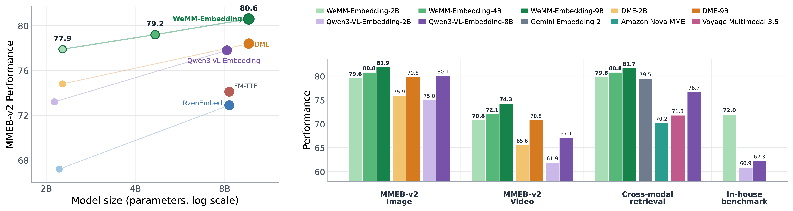

<h1 align="center">WeMM-Embedding: WeChat Multi-Modal Embedding</h1>

<p align="center">
  <a href="./README.md">English</a> | <b>中文</b>
</p>

<p align="center">
  <a href="https://huggingface.co/collections/tencent/wemm-embedding">
    
  </a>
  <a href="https://arxiv.org/abs/2608.24053">
    
  </a>
  <a href="LICENSE">
    
  </a>
</p>

WeMM-Embedding 是由微信视觉团队（WeChat Vision）研发的通用多模态 Embedding 模型系列。它为文本、图像、视频、视觉文档以及交错多模态输入提供统一表示，并在覆盖多种任务与领域的多个评测基准上取得了领先性能。

<p align="center">
  <a href="assets/performance-overview.pdf">
    
  </a>
</p>

## 模型库

| 模型 | Matryoshka 维度 | Hugging Face |
| --- | --- | --- |
| WeMM-Embedding-2B | `64, 128, 256, 512, 1024, 2048` | [🤗 Link](https://huggingface.co/tencent/WeMM-Embedding-2B) |
| WeMM-Embedding-4B | `64, 128, 256, 512, 1024, 2560` | [🤗 Link](https://huggingface.co/tencent/WeMM-Embedding-4B) |
| WeMM-Embedding-9B | `64, 128, 256, 512, 1024, 2048, 4096` | [🤗 Link](https://huggingface.co/tencent/WeMM-Embedding-9B) |

所有模型均支持文本、图像、视频、视觉文档以及交错多模态输入。Embedding 取自专用 `<embedding>` token 位置的最后一层 hidden state，并经过 L2 归一化。当前暂不支持音频输入。


## 安装

```bash
pip install -r requirements.txt
```

## Transformers

推理与复现建议使用 `transformers==5.2.0`，更新版本可能在预处理行为上有所差异。

```bash
python examples/transformers_inference.py \
  --model /path/to/WeMM-Embedding-2B \
  --image /path/to/image.jpg \
  --video /path/to/video.mp4 \
  --dimension 2048
```

该示例会分别生成文本、图像和视频的独立 Embedding。省略 `--dimension` 则使用完整 Embedding 维度。

## Sentence Transformers

```bash
python examples/sentence_transformers_inference.py \
  --model /path/to/WeMM-Embedding-2B \
  --image /path/to/image.jpg \
  --video /path/to/video.mp4 \
  --dimension 2048
```

`SentenceTransformer` 可直接加载模型，因此除本地路径外，也可使用 Hugging Face 模型 id（例如 `tencent/WeMM-Embedding-2B`）。文本、图像和视频输入均通过 `SentenceTransformer.encode()` 处理，MRL 维度由 `--dimension` 指定。

## 服务部署

已验证版本：vLLM `0.27.0` 与 SGLang `0.5.9`。

vLLM：

```bash
MODEL_PATH=/path/to/WeMM-Embedding-2B
vllm serve "$MODEL_PATH" \
  --runner pooling \
  --chat-template "$MODEL_PATH/embedding_chat_template.jinja"
```

SGLang：

```bash
MODEL_PATH=/path/to/WeMM-Embedding-2B
python scripts/patch_sglang_video.py
python -m sglang.launch_server \
  --model-path "$MODEL_PATH" \
  --is-embedding \
  --enable-precise-embedding-interpolation
```

也可使用等价的一键脚本：`scripts/serve_vllm.sh` 与 `scripts/serve_sglang.sh`。

## Matryoshka Embedding

对于支持的维度 `d`，截取完整 Embedding 后重新归一化：

```python
embedding = torch.nn.functional.normalize(embedding[..., :d], dim=-1)
```

在 MMEB-v2 上，2B 模型在 256 维时仍可保留完整维度图像与视频性能的 98.7%。

## 评测

### MMEB-v2

结果来自[技术报告](assets/WeMM_Embedding_tech_report.pdf) Table 1，覆盖 78 个数据集。图像与视频任务使用 Hit@1，视觉文档任务使用 NDCG@5。分数越高越好。

| Model | Size | AVG | Image | Video | VisDoc |
| --- | ---: | ---: | ---: | ---: | ---: |
| VLM2Vec | 2B | 47.8 | 59.7 | 29.0 | 44.0 |
| GME | 2B | 55.4 | 51.9 | 33.9 | 76.8 |
| VLM2Vec-V2 | 2B | 59.3 | 64.9 | 34.9 | 69.2 |
| Qwen3-VL-Embedding | 2B | 73.2 | 75.0 | 61.9 | 79.2 |
| DME-Small† | 2B | 74.8 | 75.9 | 65.6 | 79.9 |
| **WeMM-Embedding** | **2B** | **77.9** | **79.6** | **70.8** | **80.7** |
| **WeMM-Embedding** | **4B** | **79.2** | **80.8** | **72.1** | **82.0** |
| VLM2Vec | 8B | 53.2 | 65.5 | 34.0 | 49.1 |
| GME | 8B | 59.2 | 56.0 | 38.6 | 79.3 |
| Qwen3-VL-Embedding | 8B | 77.8 | 80.1 | 67.1 | 82.4 |
| DME-Medium† | 9B | 78.4 | 79.8 | 70.8 | 82.0 |
| **WeMM-Embedding** | **9B** | **80.6** | **81.9** | **74.3** | **83.3** |

† 闭源榜单提交，未公开发布模型权重或公开推理接口。

### MMEB-v3

结果来自[技术报告](assets/WeMM_Embedding_tech_report.pdf) Table 2，覆盖全部 190 个任务。V3-All 包含 78 个 MMEB-v2 任务、53 个文本任务、47 个 agent 任务、11 个音频任务以及 MCMR。不支持的任务记为零分。

| Model | Size | V3-All | Text | Agent | MCMR | Audio |
| --- | ---: | ---: | ---: | ---: | ---: | ---: |
| VLM2Vec-V2 | 2B | 38.3 | 24.5 | 28.7 | 4.1 | 0.0 |
| Omni-Embed-Nemotron | 3B | 43.5 | 39.2 | 36.5 | 26.1 | 36.5 |
| E5-Omni | 3B | 44.6 | 26.7 | 36.9 | 31.9 | 30.8 |
| Qwen3-VL-Embedding | 2B | 50.9 | 39.2 | 39.3 | 42.0 | 0.0 |
| **WeMM-Embedding** | **2B** | **56.0** | **45.3** | **45.1** | **42.5** | **0.0** |
| **WeMM-Embedding** | **4B** | **58.2** | **47.9** | **49.0** | **41.9** | **0.0** |
| WAVE | 7B | 26.3 | 13.7 | 11.3 | 8.9 | 31.8 |
| VLM2Vec | 8B | 32.9 | 22.2 | 19.7 | 0.9 | 0.0 |
| LCO-Embedding-Omni | 7B | 40.6 | 32.4 | 27.8 | 20.0 | 43.2 |
| GME | 8B | 43.6 | 37.1 | 35.6 | 27.3 | 0.0 |
| E5-Omni | 7B | 47.1 | 26.9 | 36.7 | 41.1 | 43.0 |
| Tianmu-Emb-Uni | 8B | 53.3 | 43.6 | 39.4 | 38.8 | 38.9 |
| Qwen3-VL-Embedding | 8B | 53.5 | 42.5 | 38.4 | 38.0 | 0.0 |
| **WeMM-Embedding** | **9B** | **59.5** | **48.8** | **51.0** | **49.3** | **0.0** |

文本任务使用 NDCG@5；agent、MCMR 与音频任务使用 Hit@1。

`mmeb_v3_eval/` 包含用于产出报告结果的 MMEB-v3 评测代码。它基于官方 [TIGER-AI-Lab/VLM2Vec](https://github.com/TIGER-AI-Lab/VLM2Vec) 流水线，仅做最小改动：多机多卡推理（`torchrun --nnodes=N`）、实现我们预处理与 batched inference 的 `wemm_embedding` backbone、与已发布模型对齐的数据集 instruction，以及 64 帧视频采样。数据下载、单机与多机命令见 `mmeb_v3_eval/README.md`。

```bash
cd mmeb_v3_eval
DATA_ROOT=/path/to/MMEB-V3 bash scripts/download_data.sh
MODEL_PATH=/path/to/WeMM-Embedding-2B DATA_BASEDIR=/path/to/MMEB-V3 \
OUTPUT_DIR=exps/wemm_embedding bash scripts/run_eval.sh
```

## 引用

如果本仓库对你有帮助，欢迎点亮 ⭐ 并引用：
```bibtex
@article{wemm-embedding,
      title={WeMM-Embedding: WeChat Multi-Modal Embedding Technical Report}, 
      author={Junjie Zhou and Ke Mei and Lei Li and Tianyi Wang and Fengyun Rao and Jing Lyu},
      year={2026},
      eprint={2608.24053},
      archivePrefix={arXiv},
      primaryClass={cs.CV},
      url={https://arxiv.org/abs/2608.24053}, 
}
```

## 许可证

除非另有说明，本仓库中由腾讯撰写的代码以 [Apache License 2.0](LICENSE) 发布。

第三方组件保留其原始许可证与版权声明。使用前请查阅相应源文件。
